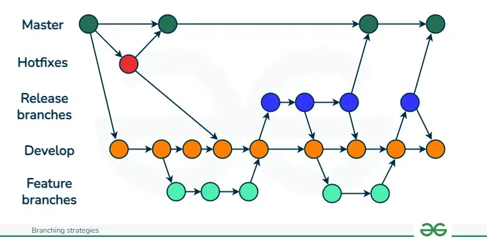
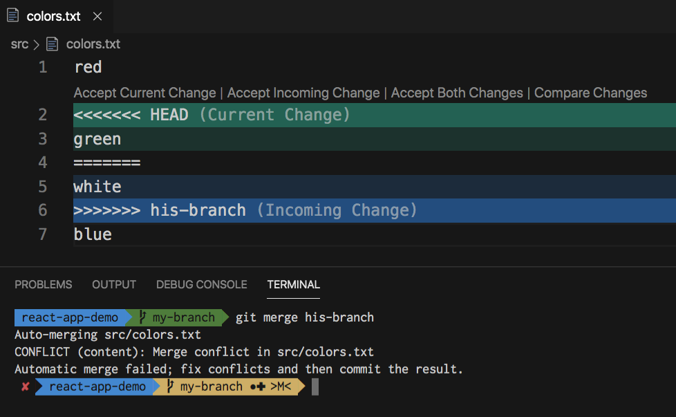

# Git - Version Control system

## What is Git?

**Git** is a distributed version control system that tracks changes in source code during software development. It helps teams collaborate, manage code history, and revert changes if needed.

- Developed by *Linus Torvalds*
- [Solve some puzzles](https://learngitbranching.js.org/?NODEMO)
- [Have some fun!](https://learngitbranching.js.org/?NODEMO)

## Are Git and GitHub the same thing?

No, GitHub is a web-based platform that hosts Git repositories in the cloud. It adds collaboration features like pull requests, issues, project boards, and CI/CD integrations.


## Setting Up

```bash
git config --global user.name "Your Name"


git config --global user.email "you@example.com"
```

Confirm whether the details are correct:

```bash
git config user.name/email
```

 ## Creating a Repository

 What is a repository?
 Think of it as a place to store all your files related to your project.

 | Command               | Description                                            |
|-----------------------|--------------------------------------------------------|
| `git init`            | Initializes a new Git repo in the current directory.  |
| `git clone <url>`     | Copies an existing repo.        |


## Making Changes

Staging: The process of selecting which changes you want to include in your next commit.

- Think of it as preparing a "snapshot" of your changes.
- Use `git add <file>`.
- Only staged files can be committed.

Commiting: This saves the staged changes to your local Git repository.

- Each commit is like a versioned snapshot of your project.
- Commits should have meaningful messages describing the change.
- Commits are local until you push them to a remote repository (on say Github servers).

Pushing: Pushing sends your local commits to a remote repository like GitHub or GitLab.

- This updates the remote repo so others can see your changes.


| Command                    | Description                                          |
|----------------------------|------------------------------------------------------|
| `git status`               | Shows current changes and what’s staged.            |
| `git add <file>`           | Stages specific file(s) for commit.                 |
| `git add .`                | Stages all changes in current directory.            |
| `git commit -m "message"`  | Saves staged changes with a message.                |
| `git push`    | Pushes the changes to repository |

To setup push to a specific branch use:

```bash
git push --set-upstream origin branch-name
```

You can also use the below command to not explicitly stage all changes:
```bash
git commit -a
```

But this only works if the file is tracked. Check status of files using:
```bash
git status
```

Example: Newly created files aren't automatically tracked and you need git add command.

Personally I suggest just use `git add .`


## Updating your local repository

#### Fetch and Pull

You can either update your repository by 'pulling' changes or 'fetch' them.

| Command     | Description                                                                   |
| ----------- | ----------------------------------------------------------------------------- |
| `git pull`  | Fetches new changes from the remote **and merges** them into your local repo. |
| `git fetch` | Only fetches the changes from remote repo, doesn't merge automatically.   |

## Branches

Master/Main: The branch which contains the implemented code.

To avoid breaking working code, you can create separate branches for testing new features or making changes.

- Work on new ideas in isolation
- Keep the main branch clean
- Merge back into `main` after testing and review

```bash
# Create and switch to a new branch
git checkout -b feature-name

# Switch back to main
git checkout main

# Merge the feature branch into main
git merge feature-name
```




## Merge Conflicts

```bash
git checkout main
git merge branch-name
```

- If there’s a conflict, Git won't let the merge take place, until they are resolved.
- Open the file and manually resolve the conflicts (look for <<<<<<<, =======, >>>>>>> markers).
- Then stage the resolved files and finish the merge:

```bash
git add <resolved-files>
git commit
```




## Forking

Forking a repository means creating a personal copy of someone else’s GitHub repository under your own GitHub account.

Why Fork?

Well, it gives you free access to change, add, update, delete any part of the forked repository.
Think of it as your playground where you can implement various things, taking the forked repository as your base.

Later, you can propose changes to the original repo using a Pull Request.


## Pull Request

A Pull Request (PR) is a way to propose changes from one branch (often a feature branch) into another (commonly main or master).

Think of it as a security measure to ensure that only the administrators of the repo can make sure that the code pushed makes sense and would work.

It allows:
- Code review
- Discussion
- Approval before merging
- CI/CD testing workflows (if set up)

Essentially admins get the ability to merge the code after they are satisfied with the work.

PRs also help you contribute to Open Source projects.

_`> This file was added into the Missing Semester repo through a PR`_


## HEAD

In Git, `HEAD` is a pointer to the current commit you’re working on—usually the latest commit on the current branch.

It basically tells git where in the version history you are, by default you are at the latest version

- When you make a new commit, `HEAD` moves forward to point to the new commit.
- When you switch branches (`git checkout feature`), `HEAD` points to the latest commit of that branch.

If you checkout a specific commit (not a branch), you enter **detached HEAD** state:

```bash
git checkout <commit-hash>
```
This moves HEAD to a specific past commit, but you're no longer on any branch. If you make new commits here, they’ll be orphaned unless you create a new branch.

You can also use:
`HEAD~n	`
to reference n commits before HEAD.

Example:

```bash
git checkout HEAD~1
```

```bash
git show HEAD~2
```

Whats the use of HEAD?

Undoing commits: `git reset --hard HEAD~1` (Undoes latest commit)
 
Create a branch: `git checkout -b old-state HEAD~3`


## .gitignore

These are the files you don't want git to stage/commit/push (even with add .).

This can be API keys, large datasets etc.

Never push your API keys ever, keep them in a file, fetch the key from the file, and have that file in .gitignore.

## Commit History

You can use the below command to look at the commit history

```bash
git log
```

There are various commands:

```bash
git log --oneline        # One line per commit
git log --stat           # Show changes made in each commit
git log --graph          # Visualize branches and merges
git log -p               # Show actual diff of each commit
```

## Git Blame

This shows who last modified each line of a file. This is helpful when trying to understand:
- ~~Who messed up~~ Who wrote a specific piece of code.
- When it was written.
- Why a bug or behavior might have been introduced.


```bash
git blame <filename>

git blame -L 20,40 main.py

```

## Git Object IDs (SHA-1)

Git identifies all objects (files, trees, commits) using a SHA-1 (Secure Hash Algorithm 1) hash of their contents.

```bash
echo "hello world" | git hash-object --stdin
# Output: e59ff97941044f85df5297e1c302d260b85e0b48
```
Git is highly storage-efficient, thanks to its use of SHA-1 hashes and a content-addressable model. This means Git tracks changes to file contents, not files themselves.

In multiple versions, not every file duplicate is stored.

- Git stores the snapshots.
- Every file (blob), directory (tree), and commit is hashed using SHA-1.
- If a file’s content hasn't changed, Git doesn’t store it again.